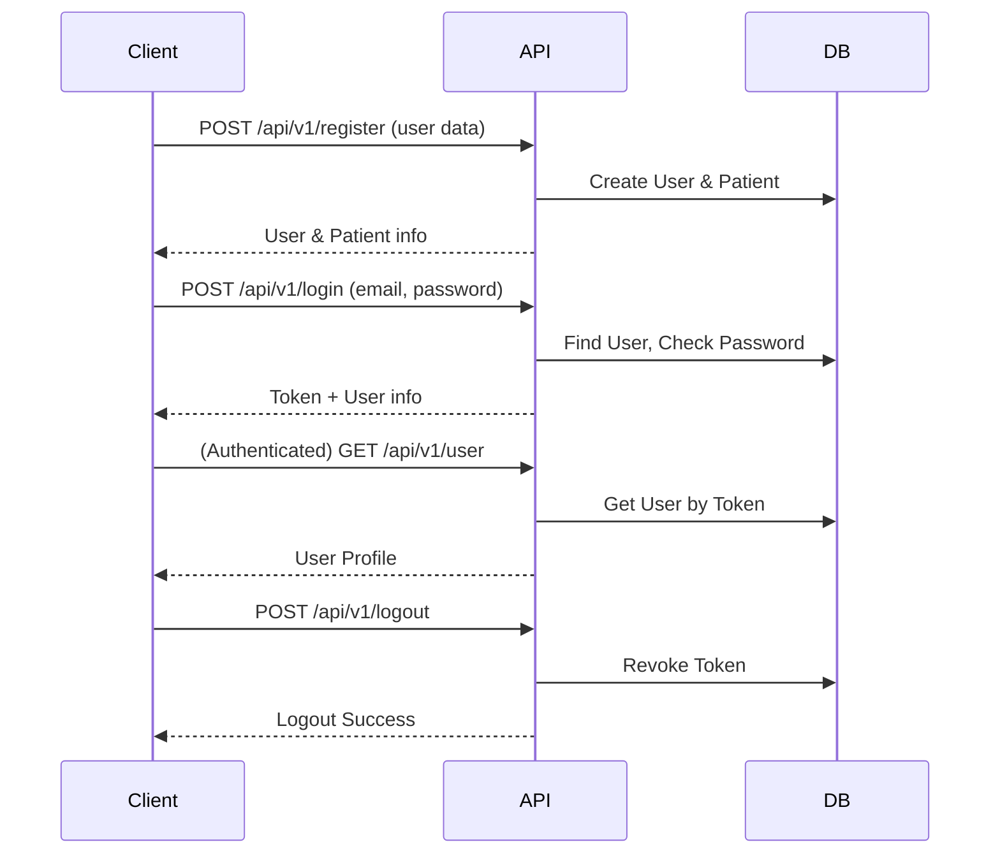

# System Architecture: Backend

## Overview
The backend is architected as a modular, scalable RESTful API using Laravel 12 (PHP 8.2+). It is designed for integration with a Vue.js frontend and supports real-time features, robust authentication, and role-based access control.

---

## High-Level Architecture
- **API Layer**: Exposes RESTful, versioned endpoints under `/api/v1/`.
- **Business Logic Layer**: (Planned) Service classes to encapsulate core business rules.
- **Data Access Layer**: Eloquent ORM for database interaction; repository pattern recommended for complex queries.
- **Real-Time Layer**: Event broadcasting for queue updates (Laravel Echo/Pusher/WebSockets).
- **Authentication & Authorization**: Laravel Sanctum for token auth; policies and middleware for RBAC.
- **Database**: MariaDB (or MySQL), normalized schema, managed via migrations and seeders.

---

## Component Breakdown
- **Controllers**: Orchestrate requests, delegate to models/services, return API resources.
- **Models**: Eloquent models for User, Doctor, Patient, Appointment, Queue.
- **Requests**: Form request classes for input validation.
- **Resources**: API resource classes for consistent response formatting.
- **Policies**: Centralized authorization logic for all major entities.
- **Events**: Real-time queue and notification events.
- **Config**: Environment, database, queue, mail, and CORS settings.

---

## Technology Stack
- **Framework**: Laravel 12 (PHP 8.2+)
- **Database**: MariaDB (Dockerized)
- **Authentication**: Laravel Sanctum
- **Real-Time**: Laravel Echo, Pusher/WebSockets (event-driven)
- **Testing**: PHPUnit, Laravel test utilities
- **Containerization**: Docker Compose for database (full stack planned)

---

## Key Design Patterns & Conventions
- **MVC**: Clear separation of models, views (resources), and controllers
- **Form Request Validation**: Centralized input validation
- **Policy-Based Authorization**: Role and resource-based access control
- **API Resource Formatting**: Consistent, frontend-friendly responses
- **Event-Driven Real-Time Updates**: Decoupled queue notifications
- **Service/Repository Layer**: Planned for business logic and data access abstraction

---

## Data Flow & Request Lifecycle
1. **Request**: Client sends HTTP request to `/api/v1/...`
2. **Routing**: Laravel routes request to appropriate controller
3. **Validation**: Form request validates input
4. **Authorization**: Policy/middleware checks permissions
5. **Business Logic**: Controller (and future service) processes request
6. **Persistence**: Eloquent ORM interacts with the database
7. **Event Dispatch**: For real-time features, events are broadcast
8. **Response**: API resource formats and returns the response

---

## Separation of Concerns
- **Controllers**: Thin, orchestration only (move business logic to services)
- **Services**: (Planned) Encapsulate business rules and workflows
- **Repositories**: (Optional) Abstract complex data access
- **Models**: Data representation and relationships
- **Resources**: Output formatting
- **Policies**: Authorization
- **Events**: Real-time communication

---

## Extensibility & Scalability
- **Service Layer**: Planned for maintainable, testable business logic
- **Repository Pattern**: Recommended for complex queries
- **API Versioning**: All endpoints under `/api/v1/` for future-proofing
- **Real-Time**: Event-driven, scalable with WebSockets/Pusher
- **Dockerization**: Database containerized; full stack planned

---

## References
- See `Technical_implementation_doc.md` for detailed requirements and design rationale.
- See `openapi.yaml` for API specification.
- See `README.md` for setup and usage instructions.

## Authentication & Authorization
- Laravel Sanctum for token auth; policies and middleware for RBAC.

### Authentication Process Diagram

The following diagram illustrates the authentication flow, including registration, login, token issuance, authenticated requests, and logout:

This process ensures secure, stateless authentication for API clients using Laravel Sanctum. All protected endpoints require a valid Bearer token, and role-based access is enforced via policies and middleware. 